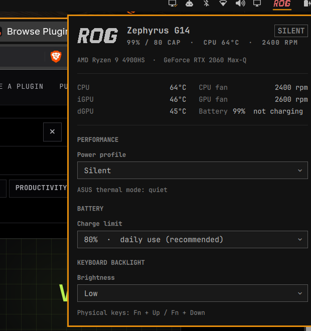

# ROG control

An [Omarchy](https://omarchy.org/) bar panel for ASUS ROG and TUF laptops. Temperatures, fan speeds, power profile, battery charge limit and keyboard backlight — in one panel, with no password prompts.



## What it does

The ROG wordmark sits in your bar. Clicking it opens the panel and changes nothing on its own — there is no click-to-cycle guesswork.

**Live sensors.** CPU, integrated GPU and discrete GPU temperatures, both fan speeds, and battery state. The discrete GPU is only queried when it is already awake, so opening the panel never wakes a sleeping dGPU just to report on it.

**Power profile.** Silent / Balanced / Turbo, through `power-profiles-daemon`. The panel labels them the way the laptop is badged but sets the profile the way the rest of Omarchy does, so the bar's own power widget stays in agreement. The raw ASUS thermal mode is shown underneath.

**Battery charge limit.** 60% / 80% / 100%, written to the standard `charge_control_end_threshold` sysfs attribute. Capping at 80% meaningfully extends the life of a laptop that mostly lives on AC. Shown read-only unless you have granted your user the write — see below; the plugin itself never elevates.

**Keyboard backlight.** Off / Low / Medium / High. A dropdown rather than a slider — four discrete hardware levels are fiddly to land on with a slider. The physical `Fn`+`Up` / `Fn`+`Down` keys keep working as normal.

## Nothing is hardcoded

This started as a config for one G14 and was generalised, so it should come up correctly on other ROG and TUF machines:

- Model, CPU and discrete GPU names come from DMI and the PCI modalias. The GPU name is resolved by parsing `pci.ids`, which is pure string handling — it never touches PCI config space, so a suspended dGPU stays suspended.
- Every hwmon, LED and PCI device is resolved **by name or driver at call time**, never by index. `hwmon4` today can be `hwmon6` after a kernel update, and a panel that hardcodes the number silently goes blank.
- Each section is gated on the sysfs attribute actually existing. No charge-limit support means no BATTERY section, rather than a dead control.

## Install

```bash
git clone https://github.com/abidfarhanRepo/omarchy-rog-control \
  ~/.config/omarchy/plugins/armnt.rog-control
omarchy restart shell
```

Then add it to your bar — via `omarchy bar`, or by adding `{ "id": "armnt.rog-control" }` to the `right` section of `~/.config/omarchy/shell.json`.

### The charge-limit control

**This plugin ships no code that runs as root** — no installer, no setuid helper, no polkit action, no `sudo` or `pkexec` call anywhere in it. Nothing root-owned ever reads or executes a file from the plugin checkout, which lives in your home directory and is therefore writable by any process running as you.

The consequence is that the charge limit is **read-only by default**: the panel displays it but does not offer the dropdown. Everything else works untouched.

To make it settable, grant your own user the write with a udev rule. Paste this into a terminal — the rule text comes from your shell, not from any file in this repository:

```bash
sudo tee /etc/udev/rules.d/99-rog-charge-limit.rules > /dev/null <<'EOF'
ACTION=="add|change", SUBSYSTEM=="power_supply", ATTR{type}=="Battery", \
  TEST=="charge_control_end_threshold", \
  RUN+="/usr/bin/chgrp wheel /sys%p/charge_control_end_threshold", \
  RUN+="/usr/bin/chmod 0664 /sys%p/charge_control_end_threshold"
EOF
sudo udevadm control --reload-rules
sudo udevadm trigger --subsystem-match=power_supply
```

Read it before you run it — that is the point of pasting it rather than executing a script.

What it does and does not grant: members of `wheel` gain write access to one battery sysfs attribute. Those users can already run `sudo`, so this grants them no privilege they did not have; it only removes the prompt. It installs no executable, and the rule is inert data rather than code. Change `wheel` to another group if your setup differs.

To undo it, delete `/etc/udev/rules.d/99-rog-charge-limit.rules` and reload as above.

The power profile and keyboard backlight never need any of this — they go through `power-profiles-daemon` and `brightnessctl`, which are unprivileged by design.

### Removal

```bash
rm -rf ~/.config/omarchy/plugins/armnt.rog-control
sudo rm -f /etc/udev/rules.d/99-rog-charge-limit.rules   # only if you added it
omarchy restart shell
```

Then remove the `{ "id": "armnt.rog-control" }` entry from the `right` section of `~/.config/omarchy/shell.json`. The plugin writes nothing else — no dotfiles, no state directory, no system files, and it never edits your configuration on its own.

## How it is put together

```
RogControl.qml    the panel: an Omarchy Panel + KeyboardPanel with Dropdowns
RogMark.qml       the ROG wordmark, drawn as vector paths
bin/rog-status    reads all hardware state, emits key<TAB>value lines
bin/rog-set       applies one setting; the only place privilege is handled
(no install/)     nothing in this plugin runs as root
```

Every read goes through `bin/rog-status` and every write through `bin/rog-set`, both resolved relative to the QML file so the plugin is self-contained and needs nothing on `$PATH`. Both are plain shell and can be run directly, which makes the panel easy to debug:

```bash
~/.config/omarchy/plugins/armnt.rog-control/bin/rog-status
```

The wordmark is drawn with `QtQuick.Shapes` rather than shipped as an image or borrowed from a Nerd Font, following the same pattern Omarchy uses for its own brand marks: it tints with your theme, stays sharp at any bar size, and there is no asset to go missing.

## Requirements

Omarchy 4.0+, `power-profiles-daemon`, `brightnessctl`. Both are already present on a standard Omarchy install. No external downloads, no AUR packages, nothing fetched at runtime, and no privileged component.

## Licence

MIT.
